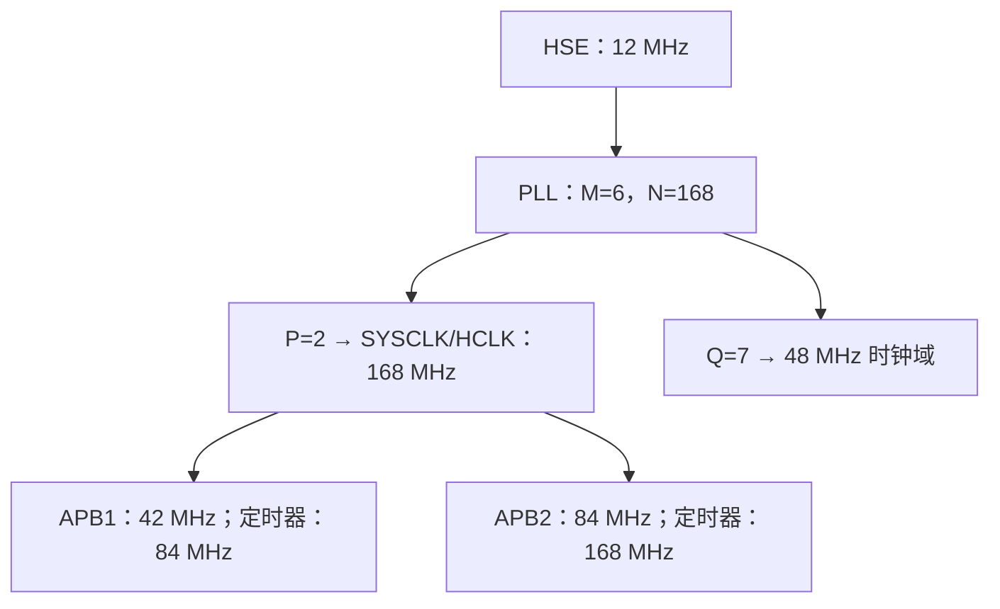

# STM32F407IGH6 C 型开发板配置、ThreadX 与内存学习手册

> 用途：复现这次配置、理解参数的来源，并逐项核对工程。
>
> 文档依据：当前工作副本的 `board/board.ioc`、生成的 HAL 初始化代码，以及基于仓库 `ba86c11` 的 ThreadX 接入修改。用户已确认本地编译成功。尚未进行实际硬件测试，也未在本次整理中运行 CubeMX 图形界面重新生成代码。
>
> 硬件前提：采用标准 RoboMaster C 型开发板的引脚分配和 **12 MHz 外部晶振**。芯片型号 `STM32F407IGH6` 本身不能证明板上晶振频率、LED 极性或接口接线；不同自制板必须以其原理图为准。

## 目录

1. [先认识配置的三个层次](#1-先认识配置的三个层次)
2. [CubeMX 操作顺序与工程设置](#2-cubemx-操作顺序与工程设置)
3. [时钟树：从晶振到外设](#3-时钟树从晶振到外设)
4. [GPIO：三色灯、片选、复位和数据就绪](#4-gpio三色灯片选复位和数据就绪)
5. [PWM：定时器如何控制舵机](#5-pwm定时器如何控制舵机)
6. [UART 与 DMA：两个串口](#6-uart-与-dma两个串口)
7. [CAN：双总线与位时序](#7-can双总线与位时序)
8. [SPI：BMI088 的通信配置](#8-spibmi088-的通信配置)
9. [I²C：IST8310 与扩展接口](#9-i²cist8310-与扩展接口)
10. [NVIC：中断优先级与处理函数](#10-nvic中断优先级与处理函数)
11. [ThreadX：内核、时基和启动](#11-threadx内核时基和启动)
12. [线程、优先级、信号量和内存池](#12-线程优先级信号量和内存池)
13. [整体堆栈和 RAM 布局](#13-整体堆栈和-ram-布局)
14. [重新生成代码和构建的检查方法](#14-重新生成代码和构建的检查方法)
15. [整个工程的核对清单与未完成项](#15-整个工程的核对清单与未完成项)
16. [推荐的学习路线和官方资料](#16-推荐的学习路线和官方资料)

## 1. 先认识配置的三个层次

不能只看 `board.ioc` 就判断整个工程是否完成。

| 层次 | 配置位置 | 负责什么 |
|---|---|---|
| 外设生成配置 | `board/board.ioc` | 芯片、引脚复用、时钟、GPIO、PWM、UART、DMA、CAN、SPI、I²C、NVIC，以及 Project Manager 的 heap/stack 参数 |
| 内核和应用配置 | `board/Core/Inc/tx_user.h`、手写适配文件、`threads/src/*.cpp` | ThreadX tick、线程数量、优先级、线程栈、内存池、信号量、线程入口 |
| 最终构建和内存配置 | `board/CMakeLists.txt`、工具链文件、`board/STM32F407XX_FLASH.ld` | 实际编译哪些源文件、选择哪个中断实现、浮点 ABI、最终 RAM/FLASH 分区与堆栈预留 |

`board.ioc` 是 CubeMX 的工程描述，生成的 `.c/.h` 是它的输出。ThreadX 当前采用手工接入，**没有通过 CubeMX 中间件页面创建线程**。

项目中的 BSP、传感器库、电机模块和控制算法还有 TODO。配置好外设，仅表示 MCU 能按这些参数初始化；还需要启动外设、实现协议和应用，再进行硬件验证。

### 1.1 当前配置总览

| 项目 | 当前值 | 核对入口 |
|---|---|---|
| 芯片 | STM32F407IGH6，UFBGA176 | `Mcu.CPN`、`Mcu.Package` |
| 外部晶振 / CPU | 12 MHz / 168 MHz | RCC、Clock Configuration |
| APB1 / APB2 | 42 / 84 MHz | 时钟树 |
| HAL 毫秒时基 | TIM6，1000 次更新/秒 | SYS + `hal_timebase.c` |
| ThreadX 时基 | SysTick，1000 tick/秒 | `tx_user.h` + `threadx_port.c` |
| RGB LED | PH10 蓝、PH11 绿、PH12 红；低电平亮 | GPIO |
| 舵机 PWM | TIM1 四通道、TIM8 三通道，50 Hz，初始 Pulse=0 | TIM1 / TIM8 |
| 串口 | USART1、USART6，115200、8N1 | USART 参数 |
| UART DMA | DMA2 的 Stream 1、2、6、7；Normal | DMA |
| CAN | CAN1、CAN2，Normal，1 Mbit/s | CAN 参数 |
| BMI088 SPI | SPI1，Mode 3，8 bit，2.625 MHz，软件 CS | SPI1 + GPIO |
| I²C | I2C1、I2C3，100 kHz，7 bit | I2C 参数 |
| 应用线程 | alive + 可选 heartbeat demo | `app_threadx.cpp` |
| 线程栈 | 两个应用线程分别 1024 B | `app_threadx.cpp` |
| ThreadX byte pool | 静态 8192 B | `app_threadx.cpp` |
| C 库 heap 最小预留 | 0x2000 = 8192 B | Project Manager + 链接脚本 |
| 主栈 MSP 预留 | 0x2000 = 8192 B | Project Manager + 链接脚本 |

## 2. CubeMX 操作顺序与工程设置

### 2.1 打开现有工程

1. 用 STM32CubeMX 打开 `board/board.ioc`，不要另建一个空工程覆盖它。
2. 在芯片信息中确认 STM32F407IGH6、UFBGA176。当前文件记录 CubeMX 6.15.0、STM32Cube FW_F4 V1.28.3。
3. 不同 CubeMX 版本可能把某些栏目放在不同位置，下面以栏目名称和参数含义为准。
4. 优先配置 RCC、SYS 和时钟树，再配置外设；外设分频计算依赖时钟。

### 2.2 Project Manager

进入 **Project Manager → Project**：

| 栏目 | 设置 |
|---|---|
| Project Name | `board` |
| Toolchain / IDE | CMake |
| Minimum Heap Size | `0x2000` |
| Minimum Stack Size | `0x2000` |

进入 **Project Manager → Code Generator**：

- 启用 **Keep User Code when re-generating**。
- 使用每个外设分别生成 `.c/.h` 的方式，对应 `ProjectManager.CoupleFile=true`。
- 手写代码放在独立文件，或者生成文件的 `USER CODE BEGIN/END` 区域。

本次手写文件和构建适配不是仅靠 `.ioc` 就能重新生成出来的。版本管理时必须同时保留这些文件和 CMake 修改。

### 2.3 SYS

进入 **Pinout & Configuration → System Core → SYS**：

1. Debug 选 **Serial Wire**，保留 PA13/SWDIO、PA14/SWCLK。
2. Timebase Source 选 **TIM6**。

使用 SWD 而不是完整 JTAG，可以释放 PB3、PB4 给 SPI1。TIM6 是 HAL 的基础计时器，不占用 TIM1、TIM8 的舵机 PWM。

## 3. 时钟树：从晶振到外设

### 3.1 CubeMX 的具体操作

1. **System Core → RCC → High Speed Clock (HSE)** 选 **Crystal/Ceramic Resonator**。
2. 确认 PH0/OSC_IN、PH1/OSC_OUT 分配给晶振。
3. 打开 **Clock Configuration**，HSE 输入频率设为 **12 MHz**。
4. PLL Source 选 HSE；设置 PLLM=6、PLLN=168、PLLP=2、PLLQ=7。
5. System Clock Mux 选 PLLCLK。
6. AHB Prescaler=1，APB1 Prescaler=4，APB2 Prescaler=2。
7. 确认没有越界提示，SYSCLK/HCLK=168 MHz、PCLK1=42 MHz、PCLK2=84 MHz。

晶体/陶瓷谐振器模式使用 MCU 的振荡电路。若某块板提供的是一个有源时钟信号，则应使用 HSE Bypass；不能只按频率相同就混用这两种模式。

### 3.2 PLL 参数怎么计算

PLL 先分频、再倍频、最后分频：

```text
VCO 输入 = HSE / PLLM = 12 MHz / 6 = 2 MHz
VCO 输出 = VCO 输入 × PLLN = 2 MHz × 168 = 336 MHz
SYSCLK   = VCO 输出 / PLLP = 336 MHz / 2 = 168 MHz
PLLQ 输出 = VCO 输出 / PLLQ = 336 MHz / 7 = 48 MHz
```

这组参数使 PLL 输入、VCO 输出和各总线处于 STM32F407 允许范围内。168 MHz 运行还依赖正确的电源尺度和 FLASH 等待周期；生成的 `SystemClock_Config()` 应包含对应设置，不能只改 PLL 寄存器而忽略它们。在当前常见 3.3 V 设置下，代码采用 Voltage Scale 1 和 `FLASH_LATENCY_5`。



### 3.3 为什么旧时钟树不能直接沿用

旧配置按 8 MHz HSE、M=4、N=168、P=2 计算时，也能在**真实晶振为 8 MHz**的板上得到 168 MHz CPU 时钟。因此旧方案不是在所有硬件上都错误。

问题是：如果实际晶振是标准 C 板的 12 MHz，却仍用 M=4，则真实结果是：

```text
12 / 4 × 168 / 2 = 252 MHz
```

软件界面可能仍根据填入的 8 MHz 显示 168 MHz，但硬件使用真实晶振，已经超出芯片额定频率。串口、CAN、PWM 和计时也会跟着错误。

此外，旧配置的 Q=4 在 VCO=336 MHz 时产生 84 MHz，并不是规范的 48 MHz 域。本次 Q=7 得到 48 MHz，为后续需要这一时钟域的外设提供正确基础；**这不代表当前已启用 USB、SDIO 或 RNG**。

新方案的好处是匹配实际板卡、保证各外设频率计算一致，并使相关时钟域满足要求。它并不是单纯追求更高 CPU 频率。

### 3.4 APB 定时器时钟为何会乘 2

本工程 STM32F407 的 APB 定时器规则：

- APB 分频为 1：定时器时钟等于 PCLK。
- APB 分频大于 1：定时器时钟等于 2×PCLK。

| 外设 | 所在总线 | 实际输入时钟 |
|---|---|---:|
| CAN1/2、I2C1/3 | APB1 | 42 MHz |
| TIM6 | APB1 定时器 | 84 MHz |
| USART1/6、SPI1 | APB2 | 84 MHz |
| TIM1、TIM8 | APB2 定时器 | 168 MHz |

不能用 CPU 的 168 MHz 直接计算所有外设的分频。Clock Configuration 中出现某个频率字段，也不意味着该外设已开启。

### 3.5 代码核对

查看 `board/Core/Src/main.c` 的 `SystemClock_Config()`，确认 HSE、PLL 和总线分频；查看工程 `HSE_VALUE` 定义，确认也是 12000000。

关键 `.ioc` 字段：

```ini
RCC.HSE_VALUE=12000000
RCC.PLLM=6
RCC.PLLN=168
RCC.PLLP=RCC_PLLP_DIV2
RCC.PLLQ=7
RCC.APB1CLKDivider=RCC_HCLK_DIV4
RCC.APB2CLKDivider=RCC_HCLK_DIV2
```

## 4. GPIO：三色灯、片选、复位和数据就绪

### 4.1 三色灯的 CubeMX 操作

在芯片引脚图上分别点击 PH10、PH11、PH12，选择 **GPIO_Output**；进入 **System Core → GPIO**，设置：

| 引脚 | User Label | 输出模式 | Pull | Speed | 初始输出 |
|---|---|---|---|---|---|
| PH10 | LED_B | Output Push Pull | No pull | Low | High |
| PH11 | LED_G | Output Push Pull | No pull | Low | High |
| PH12 | LED_R | Output Push Pull | No pull | Low | High |

标准 C 板这三路 LED 低电平点亮，初始 High 表示关闭。

```c
// 红灯亮
HAL_GPIO_WritePin(LED_R_GPIO_Port, LED_R_Pin, GPIO_PIN_RESET);
// 红灯灭
HAL_GPIO_WritePin(LED_R_GPIO_Port, LED_R_Pin, GPIO_PIN_SET);
// 绿灯翻转
HAL_GPIO_TogglePin(LED_G_GPIO_Port, LED_G_Pin);
```

### 4.2 GPIO 原理

- **推挽输出**：上下两个输出晶体管主动驱动高电平和低电平，适合 LED、片选和复位。
- **开漏输出**：只能主动拉低，释放时依靠上拉产生高电平；I²C 需要这种行为。
- **上拉/下拉**：给没有强驱动的引脚提供默认电平。外部电路已稳定驱动时通常无需内部上拉。
- **Speed**：控制输出边沿能力/转换速度，不是让程序每秒执行多少次。LED 用 Low 足够；高速信号需要结合频率和布线选择。
- **复用 AF**：把引脚连接到某个外设，GPIO 普通输出不能代替正确的 UART/SPI/PWM 复用。

生成的 `MX_GPIO_Init()` 应先通过 `HAL_GPIO_WritePin()` 设置输出锁存值，再把引脚切为输出，减少初始化时的不必要跳变。上电到代码运行前的电平还取决于硬件电路。

把 HAL 调用继续向下追，可以看到这些寄存器：

| 寄存器 | 作用 |
|---|---|
| MODER | 选择输入、输出、复用或模拟模式 |
| OTYPER | 推挽或开漏 |
| OSPEEDR | 输出速度档位 |
| PUPDR | 上拉、下拉或无上下拉 |
| AFRL/AFRH | 选择复用外设编号 |
| IDR | 读取引脚实际输入电平 |
| ODR | 输出锁存值 |
| BSRR | 用一次寄存器写入设置/复位指定输出位 |

`HAL_GPIO_WritePin()` 利用 BSRR 避免普通读-改-写 ODR 时的竞争。但这不等于完整业务操作自动线程安全，例如翻转状态与其他线程写同一灯仍可能互相干扰。

### 4.3 传感器相关 GPIO

| 引脚 | 标签 | 配置 | 含义 |
|---|---|---|---|
| PA4 | CS1_ACCEL | 推挽、上拉、High speed、初始 High | BMI088 加速度计片选，低有效 |
| PB0 | CS1_GYRO | 推挽、上拉、High speed、初始 High | BMI088 陀螺仪片选，低有效 |
| PG6 | RSTN_IST8310 | 推挽、无上下拉、Low speed、初始 High | IST8310 复位，低有效；初始释放复位 |
| PC4 | INT1_ACCEL | Input、No pull | 加速度计事件/数据就绪通知 |
| PC5 | INT1_GYRO | Input、No pull | 陀螺仪事件/数据就绪通知 |
| PG3 | DRDY_IST8310 | Input、No pull | 磁力计数据就绪通知 |

这些输入的当前配置是 **GPIO_Input，不是 GPIO_EXTI**。所以它们不会自动进入 STM32 中断回调。

数据就绪信号的作用是通知 MCU“有新数据可读”，数据本身仍通过 SPI 或 I²C 传输。传感器寄存器决定是否输出通知、输出极性、推挽/开漏和脉冲/锁存行为，必须和 GPIO/EXTI 配置一致。

若后续改为中断采样：

1. 根据传感器数据手册设置中断输出及映射。
2. 根据输出电路决定是否需要上拉。
3. 在 CubeMX 将引脚切为相应上升沿/下降沿 EXTI。
4. 开启对应 EXTI NVIC；PC4 对应 EXTI4，PC5 属于 EXTI9_5，PG3 对应 EXTI3。
5. 中断回调只记录事件/唤醒采样线程，复杂运算放在线程中。

当前没有完成上述 EXTI 采样链路，也没有完整的 IMU 轮询采样实现。

## 5. PWM：定时器如何控制舵机

### 5.1 引脚和通道

| 定时器 | 通道 | 引脚 | 复用 |
|---|---|---|---|
| TIM1 | CH1 | PE9 | AF1 |
| TIM1 | CH2 | PE11 | AF1 |
| TIM1 | CH3 | PE13 | AF1 |
| TIM1 | CH4 | PE14 | AF1 |
| TIM8 | CH1 | PC6 | AF3 |
| TIM8 | CH2 | PI6 | AF3 |
| TIM8 | CH3 | PI7 | AF3 |

本次准备了这些 PWM 输出。具体舵机插在哪个接口，必须以接口原理图确认，不能仅靠“CH1”猜板上插座。

### 5.2 CubeMX 操作

进入 **Timers → TIM1**：

1. Clock Source 选 Internal Clock。
2. Channel 1～4 选 PWM Generation CHx，确认映射到上表引脚。
3. Parameter Settings：Prescaler=167、Counter Period=19999、Counter Mode=Up、Clock Division=DIV1。
4. 各通道 PWM Mode=PWM mode 1、Pulse=0、Polarity=High。
5. Auto-reload preload 当前为 Disable。

TIM8 同样设置，启用 CH1～3；GPIO 使用对应 AF 推挽输出。当前生成代码为无上下拉、Low speed。

### 5.3 频率、周期和脉宽

PSC 和 ARR 都有“加一”规则：

```text
计数频率 = TIMCLK / (PSC + 1)
PWM 频率 = TIMCLK / [(PSC + 1) × (ARR + 1)]
```

本工程：

```text
计数频率 = 168000000 / 168 = 1000000 Hz
一个计数 = 1 µs
周期 = 20000 个计数 = 20 ms
PWM 频率 = 50 Hz
```

PWM1、向上计数、有效高电平时，可以理解为 CNT 小于 CCR 时输出有效，超过比较值后输出无效。

| CCR / Pulse | 高电平脉宽 | 20 ms 周期中的占空比 |
|---:|---:|---:|
| 0 | 0 µs | 0% |
| 1000 | 1 ms | 5% |
| 1500 | 1.5 ms | 7.5% |
| 2000 | 2 ms | 10% |

很多舵机以约 1.5 ms 为中位，但角度范围、端点脉宽和允许刷新频率必须查具体舵机说明。不能把任何型号都直接映射成“1 ms=0°、2 ms=180°”。舵机主要识别脉宽；保持相同占空比却改变周期，会改变脉宽。

### 5.4 初始化不等于开始输出

当前 Pulse=0 是初始无有效脉冲。后续应用需要设置比较值并启动：

```c
// 示例：TIM1 CH1。实际通道按接线确定。
__HAL_TIM_SET_COMPARE(&htim1, TIM_CHANNEL_1, 1500);
HAL_StatusTypeDef status = HAL_TIM_PWM_Start(&htim1, TIM_CHANNEL_1);
// 应用应检查 status，再继续执行。
```

TIM1/TIM8 是高级定时器，还有主输出使能 MOE、刹车和互补输出等机制。使用 HAL 正常 PWM 启动流程即可处理基本使能，不需要为了普通舵机启用互补输出或死区。

同一定时器的各通道共享 PSC/ARR，所以它们可以有不同脉宽，但不能各自采用不同周期。ARR preload 和 CCR preload 是不同配置；若后续动态修改周期，应学习影子寄存器和更新事件，避免周期中途改变造成跳变。

当前不配置 IMU 加热用 TIM10/PF6；`RM_ENABLE_IMU_HEATER` 默认 OFF。开启加热需要另外完成定时器、控制算法与硬件确认。

## 6. UART 与 DMA：两个串口

### 6.1 引脚和 CubeMX 参数

| 外设 | TX | RX | 引脚 AF | 外设时钟 |
|---|---|---|---|---:|
| USART1 | PA9 | PB7 | AF7 | 84 MHz |
| USART6 | PG14 | PG9 | AF8 | 84 MHz |

进入 **Connectivity → USART1 / USART6**，两者分别设置：

1. Mode=Asynchronous，方向=Receive and Transmit。
2. Baud Rate=115200，Word Length=8 Bits，Parity=None，Stop Bits=1。
3. Hardware Flow Control=None。
4. Over Sampling=16 Samples。
5. 确认引脚没有被 CubeMX 自动放到其他可选脚。

`.ioc` 的正确字段为 `USART1.OverSampling=UART_OVERSAMPLING_16`，USART6 同样如此。枚举字符串不能随意缩写。

### 6.2 异步串口如何工作

UART 两端不共享时钟线，依靠约定波特率识别每一位。8N1 的一个字符包括 1 个起始位、8 个数据位、1 个停止位，共 10 bit。

```text
115200 bit/s ÷ 10 bit/字符 = 理论上约 11520 字节/s
```

这没有扣除协议头、校验、软件间隙等开销。过采样 16 用于位采样和判定，不表示每个字符有 16 个数据位。USART 使用 PCLK 和 BRR 分频获得波特率，实际值存在分频量化误差，双方时钟误差也影响通信。

当前 84 MHz、过采样16时，可用下面的量化计算理解 BRR：

```text
USARTDIV = 84000000 / (16 × 115200) ≈ 45.5729167
整数部分45，小数部分量化为9/16
BRR = (45 << 4) + 9 = 0x2D9
实际波特率 ≈ 84000000 / 729 ≈ 115226 bit/s
```

CR1 管理使能、收发和部分格式；CR2 管理停止位等；CR3 管理 DMA 请求等；BRR 管理波特率；数据寄存器承载发送/接收数据。读 HAL 源码时可以把这些位和 CubeMX 参数一一对应。

接线时本板 TX 接对方 RX、RX 接对方 TX，并共地；裸 MCU UART 是逻辑电平接口，不能直接接 RS-232 的电压接口。

当前没有额外开启 USART3/DBUS。若作业后续要求遥控器，需要单独核对接口、波特率、校验位和接收协议。

### 6.3 DMA 配置过程

在各 USART 的 **DMA Settings → Add** 中加入 RX 和 TX，选择下表映射：

| 请求 | DMA Stream | Channel | 方向 | 优先级 |
|---|---|---|---|---|
| USART1_RX | DMA2_Stream2 | Channel 4 | Peripheral to Memory | High |
| USART1_TX | DMA2_Stream7 | Channel 4 | Memory to Peripheral | Medium |
| USART6_RX | DMA2_Stream1 | Channel 5 | Peripheral to Memory | High |
| USART6_TX | DMA2_Stream6 | Channel 5 | Memory to Peripheral | Medium |

统一设置：Mode=Normal；外设地址递增 Disable；内存地址递增 Enable；外设/内存宽度都为 Byte；FIFO Disable。

STM32F407 的 DMA 请求映射是固定的，Stream/Channel 不能随意选。一个 Stream 在同一时刻不能承担两个独立传输；当前四个 Stream 分开，避免了这类冲突。

DMA 控制器把 UART 数据寄存器和缓冲区之间的字节搬运接管，CPU 只需启动传输并处理完成、错误或空闲事件。它减少逐字节中断负担，但不自动理解应用协议。

### 6.4 Normal、Circular 和 Idle 的区别

- **Normal**：搬完指定长度后停止，需要重新启动下一次接收。
- **Circular**：到缓冲区末尾后回到开头，应用必须及时消费数据，防止覆盖。
- **Idle**：UART 检测到一段空闲，常用于提示一批字节可能已到达；空闲本身不保证一个完整协议包，也不自动校验长度和校验和。

当前为 Normal；尚未在应用中启动完整 DMA 接收链路。后续使用 `HAL_UART_Receive_DMA()` 或 `HAL_UARTEx_ReceiveToIdle_DMA()` 时，需要实现重新装填、回调和缓冲区所有权。不能在 DMA 尚未读完时修改发送缓冲区，也不能只加 `volatile` 就认为完成了线程间同步。

### 6.5 NVIC 与代码核对

开启 USART1/6 global interrupt，以及四个 DMA Stream 的中断，抢占优先级均为 6，子优先级 0。

核对：

- `usart.c`：8N1、115200、OverSampling 16，DMA 初始化，`__HAL_LINKDMA`。
- `dma.c`：DMA2 时钟、四个 Stream NVIC。
- `threadx_port.c`：实际 `USART1_IRQHandler()` / `USART6_IRQHandler()` 调用 `HAL_UART_IRQHandler()`。
- `usart.c` 的 MSP USER CODE：UART NVIC enable/disable。

DMA 中断和 UART 中断承担不同事件。只开 DMA 而不开 UART，中断空闲接收和 HAL 的某些发送完成流程可能无法正常闭环。

## 7. CAN：双总线与位时序

### 7.1 CubeMX 操作和引脚

| 总线 | RX | TX | AF |
|---|---|---|---|
| CAN1 | PD0 | PD1 | AF9 |
| CAN2 | PB5 | PB6 | AF9 |

进入 **Connectivity → CAN1 / CAN2**，启用 CAN，模式选 Normal，两者参数一致：

| 参数 | 值 |
|---|---:|
| Prescaler | 3 |
| Time Seg 1 / BS1 | 10 TQ |
| Time Seg 2 / BS2 | 3 TQ |
| SJW | 1 TQ |
| Automatic Bus-Off Management | Enable |
| Automatic Retransmission | Enable |

NVIC 启用 CAN1 RX0 和 CAN2 RX0，优先级 6。当前没有配置全部 CAN TX、RX1、SCE 中断。“打开所有 CAN”指芯片的两个 CAN 控制器都启用，不表示每一种中断都需要开启。

### 7.2 为什么是 1 Mbit/s

CAN 的一个 bit 被划分成多个时间量子 TQ：固定同步段 1 TQ，加 BS1、BS2。

```text
CAN 时钟 = PCLK1 = 42 MHz
TQ = Prescaler / CAN时钟 = 3 / 42000000 ≈ 71.43 ns
每 bit 的 TQ 数 = 1 + 10 + 3 = 14
bit 时间 = 14 × 71.43 ns = 1 µs
波特率 = 42 MHz / (3 × 14) = 1 Mbit/s
采样点 = (1 + BS1) / 总TQ = 11/14 ≈ 78.6%
```

SJW 是重同步时允许调整的最大量子数，不能把它再次加到位周期公式里。参数需要和其他节点、线长、收发器传播延迟共同适配；不是对所有总线都能无条件使用 1 Mbit/s。

### 7.3 CAN 的底层机制

CAN 通过显性/隐性位进行无破坏仲裁。对于同类标准帧竞争，较小的标识符通常具有更高仲裁优先级。节点还会进行 CRC、ACK 和错误检测。

STM32F407 是经典 bxCAN，单帧数据长度最多 8 字节；标准 ID 为 11 bit。它不是 CAN FD，不能直接发送 64 字节数据帧。

Auto Retransmission 表示遇到未成功发送等情况可以自动重试；Auto Bus-Off 提供 bus-off 后的自动恢复机制。它们不能修复错误波特率、断线、终端电阻缺失或没有其他节点 ACK 的问题。

### 7.4 CAN2 与 CAN1 的关系

两个控制器可以连接两个独立总线，但共享过滤器资源；CAN2 的工作还依赖 CAN1 相关时钟。MSP 初始化中需要保留这种依赖。

过滤器一般可按分界值 14 分配：CAN1 使用 0～13，CAN2 使用 14～27。`SlaveStartFilterBank` 是过滤器资源分界；它不表示 CAN 总线上 CAN2 必须“服从”CAN1。旧版本 CubeMX 出现的 Master/Slave 字样也不能按这种总线主从关系理解。

### 7.5 初始化之后还要做什么

`MX_CAN1_Init()`、`MX_CAN2_Init()` 后还需：

1. 完整初始化过滤器结构体，设置分界和接收规则。
2. 调用 `HAL_CAN_ConfigFilter()`。
3. 调用 `HAL_CAN_Start()`。
4. 开启 `CAN_IT_RX_FIFO0_MSG_PENDING` 等所需通知。
5. 在接收回调中取帧、校验并分发，发送时检查邮箱、ID 和 DLC。

**当前 BSP 中有一个必须后续修正的问题**：`bsp/src/bsp_can.cpp` 的 `CAN_Init()` 使用未整体清零的 `CAN_FilterTypeDef`，第一次配置 CAN1 时尚未设置 `SlaveStartFilterBank`。应先零初始化，并在两次 `HAL_CAN_ConfigFilter()` 之前正确设置该字段，同时检查 HAL 返回值。该问题不会必然造成编译错误。

当前启动代码未调用完整 BSP 运行链路，CAN 发送和接收分发也仍有 TODO，因此尚不能称为电机通信已完成。

物理连接需要 CAN 收发器、CAN_H/CAN_L、合适供电和共地；线型总线两端通常各放一个 120 Ω 终端。不能把 MCU 的 TX/RX 引脚直接当作 CAN_H/CAN_L。

## 8. SPI：BMI088 的通信配置

### 8.1 引脚和 CubeMX 操作

| 信号 | 引脚 | 配置 |
|---|---|---|
| SPI1_SCK | PB3 | AF5 |
| SPI1_MISO | PB4 | AF5 |
| SPI1_MOSI | PA7 | AF5 |
| 加速度计 CS | PA4 | 普通 GPIO，低有效 |
| 陀螺仪 CS | PB0 | 普通 GPIO，低有效 |

进入 **Connectivity → SPI1**：

1. Mode=Full-Duplex Master。
2. Data Size=8 Bits，First Bit=MSB First。
3. NSS=Software；两路传感器用独立 GPIO 片选。
4. Baud Rate Prescaler=32。
5. Clock Polarity=High，Clock Phase=2 Edge，即 SPI Mode 3。
6. 不开启 SPI DMA 或 SPI global interrupt，当前按基础通信接口准备。

生成的 SPI 信号 GPIO 为 AF Push Pull、No pull、Very High speed。确认 SYS 使用 Serial Wire，PB3/PB4 未被 JTAG 占用。

### 8.2 SPI 原理与时钟模式

SPI 主机提供 SCK，每个时钟移出/移入一个 bit，MOSI 和 MISO 可同时工作。主机读数据时也必须发送 dummy 字节，才能产生读取所需的时钟。

| 模式 | CPOL | CPHA | 空闲时钟 |
|---|---:|---:|---|
| Mode 0 | 0 | 0 | Low |
| Mode 1 | 0 | 1 | Low |
| Mode 2 | 1 | 0 | High |
| Mode 3 | 1 | 1 | High |

本次 Mode 3 空闲为高，第一边沿下降、第二边沿上升，按第二边沿采样。主机和传感器的采样约定必须一致。

```text
SPI1 时钟 = PCLK2 / 32 = 84 MHz / 32 = 2.625 MHz
```

这个速度低于 BMI088 数据手册给出的 10 MHz SPI 上限，适合作为初始调试配置。提速前仍需核对时序、布线和信号质量。

### 8.3 为什么需要两个 CS

BMI088 的加速度计和陀螺仪是两个独立通信单元，共享 SCK/MOSI/MISO，但分别通过 CS 选中。

一次事务要保证：目标 CS 拉低，另一个保持高；发送地址及数据；完成全部时钟后再拉高 CS。两路同时选中可能造成返回数据冲突。

软件 NSS 是 MCU 内部的管理方式，不会替你控制 PA4/PB0。若多个线程共享 SPI，还需使用互斥锁保护**整个 CS 拉低到拉高的事务**。

### 8.4 BMI088 驱动容易出错的细节

- SPI 读操作要设置地址的读标志位，不能只发送裸寄存器地址。
- 加速度计读取在地址阶段之后还包含额外 dummy 字节，不能直接把第一个返回字节当有效寄存器数据。
- 加速度计上电后的接口切换需要按数据手册完成初始 SPI 事务，并遵守上电/复位等待时间。
- 两个单元的初始化、量程、输出速率和状态需要分别配置。
- 数据寄存器通常给出原始整数；转换为加速度和角速度时要按实际量程使用灵敏度。

这些属于驱动代码，不会因为 SPI1 在 CubeMX 中配置正确就自动完成。当前 BMI088 底层读写仍有占位实现。

后续实现时应统一“底层 read 返回的是纯有效数据，还是包含 dummy 字节的原始接收序列”。当前上层的某些检查已有数据下标假设，不能上下两层都丢一个 dummy，或两层都不丢。

## 9. I²C：IST8310 与扩展接口

### 9.1 引脚和操作

| 外设 | SCL | SDA | AF | 当前用途 |
|---|---|---|---|---|
| I2C1 | PB8 | PB9 | AF4 | 板载 IST8310 磁力计通信 |
| I2C3 | PA8 | PC9 | AF4 | 扩展接口准备 |

进入 **Connectivity → I2C1 / I2C3**，分别设：

| 参数 | 当前值 |
|---|---|
| Mode | I2C |
| Speed Mode | Standard Mode |
| Clock Speed | 100000 Hz |
| Addressing Mode | 7-bit |
| Own Address 1 | 0 |
| Dual Address Mode | Disable |
| General Call Mode | Disable |
| No Stretch Mode | Disable |

对应引脚为 AF Open Drain。当前 GPIO 无内部上拉，因此必须确认板载或外设提供了合适的外部上拉。

### 9.2 I²C 为什么使用开漏和上拉

I²C 的设备共享 SDA/SCL。设备只能主动拉低，释放时由上拉电阻把线路拉高，多个设备才能共享总线而不发生推挽高低直接对抗。

上拉电阻和总线电容形成 RC，影响上升时间。阻值太大，上升过慢；太小，拉低时电流过大。不能把内部弱上拉当作所有硬件条件下都可靠的外部上拉替代品。

一次典型寄存器读取包括 START、设备地址+写、寄存器地址、重复 START、设备地址+读、数据、最后的 NACK 和 STOP。每个字节之后还有 ACK/NACK，所以总线速率不等于有效数据吞吐率。

`NoStretchMode=DISABLE` 表示没有禁止 clock stretching，不是“关闭 I²C”。Own Address 是 MCU 作为从设备时的自身地址，不是你要读取的磁力计地址。

STM32F407 这一代 I²C 外设用 CR2、CCR、TRISE 等寄存器描述时钟。标准模式下的基本关系为 `SCL ≈ PCLK1/(2×CCR)`；42 MHz、100 kHz 对应 CCR 约210。HAL 根据当前总线频率和所选模式配置这些参数。I²C 的 CCR 与定时器的 CCR 虽然名称相同，含义不同，不能混用。真实波形还受外部上拉和电容影响。

### 9.3 7-bit 地址与 HAL 参数

STM32F4 的相关 HAL I²C 设备地址参数通常要求将 7-bit 地址左移一位：

```c
// 示例地址，不代表 IST8310 的实际地址。
uint16_t hal_address = (uint16_t)(0x50u << 1);
```

是否已经左移必须在 BSP 接口中规定清楚，避免上层和下层各移一次。实际设备地址要查具体传感器数据手册和硬件地址选择，不能用 OwnAddress1=0 推断。

100 kHz 是保守的初始配置。I2C3 尚无明确外接器件，仅有总线初始化；不能宣称已经针对所有未来外设的数据手册完成配置。

### 9.4 IST8310 还需要什么

GPIO 已提供复位和 DRDY 输入；驱动还需按手册执行复位脉宽、启动等待、器件识别、测量模式设置、数据读取和单位转换。DRDY 当前未配置 EXTI，不会自动触发读取。

若在多个线程访问同一个 I²C 外设，应串行化完整事务并检查 HAL 的 BUSY、超时和错误状态。

## 10. NVIC：中断优先级与处理函数

### 10.1 当前参数

进入 **System Core → NVIC**，Priority Group 设 `NVIC_PRIORITYGROUP_4`：STM32F407 的 4 个实现优先级位用于抢占优先级，当前子优先级均为 0。

| 中断/异常 | 抢占优先级 | 用途 |
|---|---:|---|
| SysTick | 4 | ThreadX 时间推进 |
| USART1/USART6 | 6 | UART 事件 |
| DMA2 Stream1/2/6/7 | 6 | UART DMA 事件 |
| CAN1_RX0/CAN2_RX0 | 6 | CAN FIFO0 接收 |
| TIM6_DAC | 15 | HAL 毫秒时基 |
| PendSV | 15 | ThreadX 上下文切换 |
| SVCall | 15 | 系统异常优先级配置 |

NVIC 数字越小，优先级越高。相同抢占优先级的中断不能互相抢占；其处理顺序还取决于 pending 和异常号等因素。

HardFault、NMI 等不能按照普通可配置外设中断来解释。`.ioc` 序列化字段里出现的数值不代表它们变成了普通优先级 0 外设。

### 10.2 NVIC 与 ThreadX 优先级不是一个系统

ThreadX 优先级决定**哪个线程执行**；NVIC 优先级决定**哪个异常/中断执行**。线程 10 与 UART 中断 6 不能直接比较。只要中断被允许，它就可以打断普通线程。

PendSV 放在最低优先级，便于在其他中断处理完后进行上下文切换，避免在关键外设处理中途切换线程。

### 10.3 中断中的限制

- 不在 ISR 中进行阻塞等待、长时间循环或大量打印。
- 只能使用 ThreadX 明确允许在 ISR 调用的服务；不能把线程等待型 API 原样搬进 ISR。
- 当前 TIM6 优先级较低，在较高优先级 ISR 中调用 `HAL_Delay()` 可能等待永远不能运行的 TIM6，造成死锁。
- 全局关中断会同时影响两个时基；临界区必须短。
- 不把 FreeRTOS 的 `configMAX_SYSCALL_INTERRUPT_PRIORITY` 规则机械套入当前 ThreadX GNU 端口。

## 11. ThreadX：内核、时基和启动

### 11.1 为什么没有在 CubeMX 里直接添加 ThreadX

本次使用固定版本 Eclipse ThreadX **v6.4.2_rel**，Cortex-M4 GNU 端口。源码放在：

- `board/Middlewares/ThreadX/common/inc`、`common/src`。
- `board/Middlewares/ThreadX/ports/cortex_m4/gnu/inc`、`gnu/src`。

版本来源和提交记录在 `VERSION.md`。不需要为了本次方案在 CubeMX 安装其他 ThreadX 中间件包，也不要再引入另一套内核形成重复链接。

### 11.2 为什么分开两个时基

| 时基 | 硬件来源 | 处理函数 | 服务对象 |
|---|---|---|---|
| HAL tick | TIM6，1 kHz | `TIM6_DAC_IRQHandler()` → `HAL_IncTick()` | `HAL_GetTick()`、HAL 超时 |
| ThreadX tick | SysTick，1 kHz | `SysTick_Handler()` → `_tx_timer_interrupt()` | 线程 sleep、等待超时、内核定时器 |

这样 HAL 在内核启动前就能计时；ThreadX 可以独立拥有 SysTick。两者不是同一个计数器，即使都每秒加约 1000，也不要求读数绝对相同。

### 11.3 TIM6 的计算和实现

在最终时钟树下：

```text
TIM6 时钟 = 84 MHz
PSC = 83 → 计数频率 1 MHz
ARR = 999 → 每 1000 个计数更新一次
更新频率 = 84 MHz / (84 × 1000) = 1000 Hz
```

实际代码不是把 PSC=83 永久写死，而是在 `hal_timebase.c` 的 `HAL_InitTick()` 中读取当前 PCLK1，根据 APB 分频判断定时器乘 2，再计算分频。

原因：`HAL_Init()` 时系统可能仍使用 HSI 16 MHz；`SystemClock_Config()` 切到 PLL 后，HAL 会重新调用时基初始化。两阶段都要计时正确。

TIM6 IRQ 清除更新标志并直接调用 `HAL_IncTick()`。`HAL_SuspendTick()` / `HAL_ResumeTick()` 对应关闭/恢复 TIM6 更新中断。

### 11.4 SysTick 与低层端口

`threadx_port.c` 中的 `_tx_initialize_low_level()`：

1. 关闭全局中断，避免内核尚未初始化就被打断。
2. 将 VTOR 指向当前向量表 `g_pfnVectors`。
3. 从向量表首项取得系统栈顶。
4. 将 unused memory 指针设为空；应用改用明确大小的静态内存池。
5. 更新 `SystemCoreClock`。
6. 调用 `SysTick_Config(SystemCoreClock / TX_TIMER_TICKS_PER_SECOND)`。
7. 设置 SysTick=4、PendSV/SVC=15；调度器启动时恢复中断。

```text
SysTick 每 tick 的周期数 = 168000000 / 1000 = 168000
CMSIS 设置重装载值 = 168000 - 1 = 167999
```

SysTick 推进内核时间；线程睡眠到期后进入就绪状态。调度器选择就绪线程，Cortex-M4 端口通过 PendSV 保存/恢复上下文，而不是把两个线程入口函数轮流当普通函数调用。

### 11.5 启动顺序

1. 复位后从向量表加载 MSP 和复位入口。
2. 启动文件完成系统初始化、`.data` 复制、`.bss` 清零、C++ 静态初始化。
3. 进入 `main()`，执行 `HAL_Init()`，HAL TIM6 时基开始工作。
4. `SystemClock_Config()` 切换到最终时钟，并重配 HAL 时基。
5. 初始化 GPIO、DMA、CAN1/2、USART1/6、SPI1、I2C1/3、TIM1/8。
6. 在 `main.c` 的 USER CODE 区调用 `app_threadx_start()`。
7. `tx_kernel_enter()` 执行低层和内核初始化，调用 `tx_application_define()`。
8. 创建内存池、信号量、线程后进入调度器。

正常情况下 `tx_kernel_enter()` 不返回，主循环不再承担原来的轮询任务。`tx_application_define()` 是启动定义阶段，不是在一个已运行的普通线程里；不要在这里做延时等待。

### 11.6 如何防止中断函数重复

CubeMX 可能生成空的 SysTick、PendSV 等函数，而 ThreadX/手写适配也有同名实现。当前 CMake 仅对生成的 `stm32f4xx_it.c` 设置重命名宏，把其函数变为 `CubeMX_*` 名称。

| 真正占用向量的函数 | 当前来源 |
|---|---|
| SysTick_Handler | `Core/Src/threadx_port.c` |
| PendSV_Handler | ThreadX Cortex-M4 GNU 汇编 |
| TIM6_DAC_IRQHandler | `Core/Src/hal_timebase.c` |
| USART1/USART6_IRQHandler | `Core/Src/threadx_port.c` |

CMake 同时排除 CubeMX 生成的 `stm32f4xx_hal_timebase_tim.c`，使用手写 `hal_timebase.c`。最终只能存在一个实际生效的 `HAL_InitTick()`。

若生成 `main.c` 中还有默认 TIM6 period elapsed 回调，当前实际 TIM6 IRQ 不经过它，不应再额外调用一次 `HAL_IncTick()`。重复递增会造成 HAL 时间加速。

## 12. 线程、优先级、信号量和内存池

### 12.1 内核配置文件

`board/Core/Inc/tx_user.h`：

```c
#define TX_TIMER_TICKS_PER_SECOND 1000
#define TX_MAX_PRIORITIES 32
#define TX_TIMER_THREAD_STACK_SIZE 1024
#define TX_TIMER_THREAD_PRIORITY 0
#define TX_ENABLE_STACK_CHECKING
```

CMake 通过 `TX_INCLUDE_USER_DEFINE_FILE` 让内核和应用看到同一配置。修改头文件但没有让内核使用它，可能得到应用以为 1000 tick/s、内核采用其他默认值的不一致结果。

`TX_MAX_PRIORITIES=32` 对应线程优先级 0～31。当前 timer thread 优先级为 0，应保持其工作短且非阻塞；软件定时器回调过长会影响系统。

### 12.2 当前真正创建的线程

| 线程 | 栈大小 | 优先级 | 抢占阈值 | 时间片 | 启动 |
|---|---:|---:|---:|---|---|
| alive | 1024 B | 15 | 15 | 无 | Auto Start |
| heartbeat demo | 1024 B | 10 | 10 | 无 | 默认开启 |
| ThreadX timer thread | 1024 B | 0 | 内核管理 | 内核管理 | 内核创建 |

优先级数字越小越高。heartbeat demo 比 alive 优先；它发完信号后睡眠，alive 才有机会处理。高优先级线程如果永不阻塞、永不让出且一直就绪，低优先级线程会饥饿。

抢占阈值等于自身优先级时，按普通优先级抢占工作。将阈值设为更小的数字，可以阻挡一部分原本能抢占的线程；当前没有使用这种额外限制。

无时间片不等于“任何线程都无法被抢占”，它只是没有为同优先级线程安排基于时间片的轮转。等待信号量、sleep 或更高优先级线程就绪仍会改变运行状态。

### 12.3 byte pool 如何创建

`threads/src/app_threadx.cpp`：

```cpp
alignas(8) UCHAR pool_storage[8192];
constexpr ULONG alive_stack_bytes = 1024;
constexpr ULONG heartbeat_stack_bytes = 1024;
```

`tx_application_define()` 中按顺序：

1. 注册线程栈错误回调。
2. `tx_byte_pool_create()` 创建 8192 B 内存池。
3. 创建初始计数为 0 的心跳信号量。
4. `tx_byte_allocate(..., TX_NO_WAIT)` 分配 alive 栈，创建 alive。
5. 若 demo 开启，再分配其栈并创建 heartbeat demo。
6. 全部成功后设置 `app_init_status=TX_SUCCESS`。

这里的栈参数单位是 **字节**，不要套用其他 RTOS 的“栈字数”习惯。

byte pool 是一块预先提供给 ThreadX 的 RAM，管理可变大小分配。8192 B 不会全部成为有效用户栈，还需要分配管理开销和对齐。当前只在启动时分配两个应用栈；内核 timer thread 栈是另外的内核静态空间。

### 12.4 心跳与信号量

heartbeat demo 每次：

```cpp
tx_semaphore_put(&heartbeat_semaphore);
++app_heartbeat_count;
tx_thread_sleep(TX_TIMER_TICKS_PER_SECOND / 5);
```

1000 tick/s 下，sleep(200) 约为 200 ms。它让线程进入等待状态，不占用 CPU 做忙等。

`HAL_Delay()` 主要通过反复检查 HAL tick 等待，在普通线程里使用时不会像 `tx_thread_sleep()` 一样主动挂起该线程。线程中的周期等待优先使用 RTOS 服务；传感器必须满足的微秒级时序则另行选择合适机制，不能把200 µs误写成200个毫秒tick。

alive 用 `tx_semaphore_get(..., 1000)` 等待：收到信号就增加计数、关闭红灯、翻转绿灯；超时则关闭绿灯、点亮红灯。

这是计数信号量，每次 put 增加可消费通知。若生产速度长期快于消费速度会累积，后续设计真正的存活监控时要处理旧通知积压，不能把消费旧事件当作最新心跳。

信号量适合通知或计数资源；共享 SPI/I²C 的独占访问更适合 mutex，必要时启用优先级继承，避免高优先级线程被低优先级持锁者间接阻塞。

### 12.5 错误检测与调试变量

| 变量 | 正常期望 | 用途 |
|---|---|---|
| app_init_status | TX_SUCCESS | 内核对象创建结果 |
| app_stack_error | 0 | 是否检测到线程栈错误 |
| app_heartbeat_count | 持续增加 | demo 发出通知次数 |
| app_alive_count | 持续增加 | alive 成功处理次数 |

创建相关 API 使用统一 `check()` 检查返回值；失败时记录状态、亮红灯并进入 `Error_Handler()`。栈错误回调也记录状态并停止。

`volatile` 让这些变量便于调试观察，但不等于通用的线程同步保证。栈检查能帮助发现问题，却不是 MPU 隔离，也不能保证所有溢出都在破坏其他数据之前被发现。

1024 B 是这两个简单演示线程的初始配置，不能证明未来 IMU、控制或 printf 大量调用也够用。加入深层调用、大局部数组、浮点运算后，应测量最坏路径的栈使用。

### 12.6 当前还没有哪些线程

尚未创建完整 IMU 采样线程和电机控制线程。演示 heartbeat 只证明设计了一条通知/监控链路，不代表作业中的所有任务已经通过存活监测。

`RM_ENABLE_HEARTBEAT_DEMO=OFF` 时，alive 改为每 200 ms 翻转绿灯；这条路径没有监控真实业务心跳。

## 13. 整体堆栈和 RAM 布局

### 13.1 芯片内存与当前链接范围

| 区域 | 起始地址 | 大小 | 当前用途 |
|---|---|---:|---|
| FLASH | 0x08000000 | 1024 KiB | 向量表、代码、常量和初始化数据镜像 |
| 普通 SRAM | 0x20000000 | 128 KiB | 全局变量、线程池、堆、MSP 等 |
| CCM RAM | 0x10000000 | 64 KiB | 当前没有实际分配数据 |

通常说“192 KiB RAM”包含普通 SRAM 和 CCM；CCM 不能像普通 SRAM 那样被 DMA 访问。因此 UART DMA 缓冲区不能随意放进 CCM。

当前 `_estack=0x20020000`，即普通 SRAM 末尾。链接脚本虽然定义了 CCM 段，但使用带初始值的 CCM 数据还要检查启动时复制流程，不能只加一个 section 属性就认定初始化正确。

### 13.2 三种“栈/堆”不要混淆

| 名称 | 当前大小 | 谁分配/使用 | 修改位置 |
|---|---:|---|---|
| MSP 主栈预留 | 8192 B | 启动、异常、中断、内核系统上下文 | `.ioc` + `.ld` |
| C 库 heap 最小预留 | 8192 B | malloc/new 等 C/C++ 动态分配 | `.ioc` + `.ld`、`sysmem.c` |
| ThreadX byte pool | 8192 B | ThreadX 栈分配 | `app_threadx.cpp` |
| alive / demo 线程栈 | 各 1024 B | 各线程函数与上下文 | 从 byte pool 划出 |
| timer thread 栈 | 1024 B | 内核定时器处理 | `tx_user.h`，独立静态空间 |

两个应用栈已经包含在 8192 B 的 pool 中，不能再次把 2048 B 加到总 RAM 预算上。C heap 与 pool 是不同内存，不会自动共享空闲块。

Cortex-M4 ThreadX 端口使用 PSP 保存普通线程栈，异常处理使用 MSP。每个线程拥有独立栈空间，线程局部变量、函数调用和保存的上下文都会占用它。

异常进入时硬件自动保存一部分寄存器，端口再保存调度所需的其余上下文，切换 PSP 后恢复下一个线程。使用 FPU 的路径还可能需要更多浮点上下文空间。因此线程栈既要容纳局部变量和调用链，也要留出上下文保存、异常相关开销和安全余量，不能只按局部数组大小相加。

### 13.3 CubeMX 和链接脚本的对应关系

`.ioc`：

```ini
ProjectManager.HeapSize=0x2000
ProjectManager.StackSize=0x2000
```

实际使用的 `board/STM32F407XX_FLASH.ld`：

```ld
_Min_Heap_Size = 0x2000;
_Min_Stack_Size = 0x2000;
_estack = ORIGIN(RAM) + LENGTH(RAM);
ASSERT(_end + _Min_Heap_Size <= _estack - _Min_Stack_Size,
       "RAM heap/stack overlap")
```

ASSERT 能检查链接时静态区域加最小堆、主栈预留是否放得下；它不能证明运行时每个线程栈永不溢出。

**重要细节：8192 B 是当前 C heap 的最小链接预留，不是严格的 malloc 最大容量。** 当前 `sysmem.c` 的 `_sbrk()` 从 `_end` 向上增长，边界是 `_estack - _Min_Stack_Size`，可以使用尚未分配的普通 SRAM，直到碰到预留主栈边界。若需要严格限制为 8 KiB，应另外设计 heap end，而不是只改 `_Min_Heap_Size`。

主栈从高地址向下增长。如果实际使用超过预留值，仍可能破坏其他内存；链接脚本不是运行时栈保护机制。

### 13.4 常见段的意义

- `.text`：程序代码，通常在 FLASH。
- `.rodata`：只读常量，通常在 FLASH。
- `.data`：有非零初值的可写全局/静态变量，运行位置在 RAM，初始内容镜像在 FLASH。
- `.bss`：零初始化全局/静态变量，启动时清零，消耗 RAM。
- `._user_heap_stack`：链接时预留/检查 heap 和 MSP 的空间。

`pool_storage` 虽然被称为“内存池”，本质是静态数组，属于静态 RAM；不需要先 malloc 8192 B。

### 13.5 已有构建记录如何解读

本次工作副本在 Arm GNU 13.2.1 的构建记录：

| 配置 | FLASH | 普通 SRAM（含预留） | CCM |
|---|---:|---:|---:|
| 默认 Debug | 33908 B | 27784 B | 0 B |
| Release | 18708 B | 27784 B | 0 B |

这些是当时配置的链接统计，不是运行时 peak heap 或栈高水位。用户本机使用不同编译器/优化/代码后可能不同，应以自己的 `board.map` 为准。剩余地址空间也不等于已经分配给某线程的可用栈。

初始各 8 KiB 的 heap/MSP 提供了较宽裕余量，但不是普适最优值。未来扩展线程和缓冲区时，应根据 map 与运行测量共同调整。

## 14. 重新生成代码和构建的检查方法

### 14.1 CubeMX Generate Code 前后

生成前保存并查看 Git diff。生成后重点检查：

1. `main.c` USER CODE 中 `app_threadx_start()` 的声明/调用保留。
2. SYS Timebase Source 仍为 TIM6。
3. UART NVIC 初始化保留，生成的 UART/DMA handler 对应正确句柄。
4. `board/CMakeLists.txt` 中手写源文件、ThreadX 库、handler 重命名及生成时基排除规则保留。
5. `board/STM32F407XX_FLASH.ld` 的内存区域、heap/stack 和 ASSERT 保留。
6. 生成配置确实采用期望的引脚和参数，而不是因为复用冲突重新选择引脚。
7. 重新运行 CMake 配置并编译，不能只把旧 ELF 当成新代码的结果。

“Keep User Code”主要保护生成文件的 USER CODE 区，并不保证所有手工修改的 CMake 或链接脚本内容都不被改写；必须用 diff 核对。

### 14.2 构建入口

推荐在 VS Code 的 PowerShell 终端进入 `board` 目录：

```powershell
cmake --preset Debug
cmake --build --preset Debug
```

输出包括 `board/build/Debug/board.elf`、`board.hex`、`board.bin`、`board.map`。

当工程路径或编译器路径变化、旧缓存持续引用错误工具链时，在 **board 目录**清理该构建目录后再配置：

```powershell
Remove-Item -Recurse -Force .\build\Debug
cmake --preset Debug
cmake --build --preset Debug
```

如果目录不存在，第一条可跳过。删除的是可再生构建产物，不是 `Core`、`Middlewares` 或源码目录。

这次用户清理后编译成功，说明新的构建配置可用；仅凭这个现象不能断言之前的 `bits/c++config.h` 报错一定是哪一种安装损坏。以后出现类似错误，应检查实际使用的 `arm-none-eabi-g++`、CMake 缓存、完整工具链目录及环境 include 路径，不要直接把示例 `D:\Tools\ArmGNU` 当成本机已安装路径。

### 14.3 编译设置为什么重要

当前 CMake 启用 C11、C++17 和 ASM。ASM 必须启用，因为 ThreadX 的上下文切换由汇编端口实现。

统一 Cortex-M4/FPU 参数：

```text
-mcpu=cortex-m4 -mthumb -mfpu=fpv4-sp-d16 -mfloat-abi=hard
```

C、C++、内核和所链接的库必须采用兼容 ABI。不能随意把 hard-float 与 soft-float 对象混合。

当前关闭 C++ exceptions、RTTI 和线程安全静态初始化机制，以适配现有嵌入式构建。尤其最后一项意味着：不要假设多个线程首次进入同一个函数时，函数内静态对象会自动获得完整的线程安全初始化保护；可在调度前初始化或显式同步。

### 14.4 不用硬件也能核对的内容

在 board 目录，工具已加入 PATH 时：

```powershell
arm-none-eabi-size .\build\Debug\board.elf
arm-none-eabi-nm -n .\build\Debug\board.elf | Select-String 'SysTick_Handler|PendSV_Handler|TIM6_DAC_IRQHandler|USART1_IRQHandler|USART6_IRQHandler|_estack|_Min_Heap_Size|_Min_Stack_Size'
```

再查 map 文件中的对象来源，确认实际异常 handler 来自预期实现。存在 `CubeMX_*` 的重命名副本本身不表示重复占用了向量。

还应检查最终链接命令采用 **board 目录的链接脚本**。仓库根目录如果保留同名旧文件，不表示它就是实际生效版本。

## 15. 整个工程的核对清单与未完成项

### 15.1 静态配置检查表

下面复选框用于你自己在本机逐项打勾；它们不是硬件验收通过声明。

- [ ] 芯片型号、封装和实际板卡匹配。
- [ ] 实际晶振确认是 12 MHz；HSE 模式符合晶振/有源时钟类型。
- [ ] PLL M6/N168/P2/Q7；AHB1/APB1÷4/APB2÷2。
- [ ] `SystemClock_Config()` 与 `.ioc` 一致，HSE_VALUE 无冲突定义。
- [ ] SWD 保留，PB3/PB4 可用于 SPI。
- [ ] 三色灯 PH10/11/12 均为推挽输出、初始 High，标签正确。
- [ ] 两路 BMI088 CS 初始 High，IST8310 复位初始释放。
- [ ] PC4/PC5/PG3 当前是普通输入，未误认为已启用 EXTI。
- [ ] TIM1 四通道、TIM8 三通道引脚正确，PSC167/ARR19999/Pulse0。
- [ ] USART1、USART6 均为 115200/8N1/过采样16。
- [ ] 四路 DMA 映射无冲突；Normal/Byte/MemInc 设置一致。
- [ ] UART 与 DMA IRQ 均有正确实际 handler。
- [ ] CAN1/2 均为 Normal；3/10/3/SJW1 对应 1 Mbit/s。
- [ ] CAN2 初始化保留 CAN1 时钟依赖；RX0 中断打开。
- [ ] SPI1 为 Mode3/8bit/MSB/软件NSS/÷32，CS 使用普通 GPIO。
- [ ] I2C1/3 为 100 kHz/7bit；开漏和外部上拉条件匹配。
- [ ] HAL 用 TIM6，ThreadX 用 SysTick，没有重复递增 tick。
- [ ] `tx_user.h` 实际参与内核编译；tick1000/优先级32/栈检查开启。
- [ ] alive/demo 栈各1024 B，pool8192 B，优先级15/10。
- [ ] `.ioc` 与实际 `.ld` 的 heap/MSP 预留都为0x2000。
- [ ] map 中 ThreadX、BSP、libs、modules、threads 对象均按实际引用正确链接。
- [ ] 重新生成后的 CMake 配置和构建成功。

### 15.2 完成程度

| 功能 | 当前已具备 | 仍需完成 |
|---|---|---|
| 时钟/GPIO | 参数和生成代码 | 实物时钟、灯极性验证 |
| PWM | 定时器和引脚初始化 | 启动指定通道、设脉宽、舵机端点验证 |
| UART | 双串口、DMA、IRQ 基础 | 接收启动、回调、重装填、协议和通信测试 |
| CAN | 双控制器位时序/IRQ | 修正过滤器初始化、启动、发送/反馈分发、电机验证 |
| SPI/BMI088 | 总线和片选配置 | 真实寄存器读写、初始化、采样、单位换算 |
| I²C/IST8310 | 总线、复位和DRDY引脚 | 器件驱动、初始化和数据验证 |
| ThreadX | 内核、双时基、应用创建代码，编译链接 | 实物调度/tick/监控验证，业务线程接入 |
| PID/电机模块 | 源码纳入构建 | TODO 算法、注册、闭环和保护逻辑 |
| 内存 | pool与堆栈预算、链接检查 | 最坏路径栈余量、运行时分配测试 |

完整编译只证明语法、符号和链接关系等检查通过。占位函数返回固定值也可以编译，因此必须按功能检查实现内容。

### 15.3 有硬件后再执行的验证计划

按你的要求，现阶段跳过上板执行；保留以下项目供以后使用：

1. 测三色 LED，确认低电平亮和颜色映射。
2. 示波器/逻辑分析仪测 PWM：20 ms 周期、指定1.5 ms脉宽。
3. 双 UART 回环/对端通信，覆盖 DMA 完成、Idle 和重装填。
4. CAN 与已知正常节点通信，检查过滤器、ACK、错误和反馈帧。
5. SPI/I²C 先读取器件识别，再读实时数据，确认 dummy/地址/单位处理。
6. 观察 app_init_status=TX_SUCCESS、app_stack_error=0，两个心跳计数递增。
7. 正常情况下绿灯约每200 ms翻转，完整亮灭周期约400 ms；红蓝灯关闭。
8. 只挂起 heartbeat demo 线程，等积压通知消耗后确认 alive 约1秒超时亮红灯；暂停整个CPU不能测试这个超时。
9. 比较同一墙钟区间内 HAL_GetTick 和 tx_time_get 的增量，均应约1000/s。
10. 执行最长调用路径，测各线程和MSP栈余量，再决定是否调整栈预算。

## 16. 推荐的学习路线和官方资料

### 16.1 每次学习一个完整链路

建议按“电路连接 → `.ioc` 参数 → HAL 初始化 → 运行调用 → 中断/回调 → 应用结果”来追踪。

例如学舵机：先确认插座连接 PE9/TIM1_CH1；用时钟树得到168 MHz；用PSC/ARR计算50 Hz；在`tim.c`确认参数；在线程中设CCR并启动；最后用示波器确认真实波形。

学 ThreadX 则先追踪“复位 → main → 内核入口 → 对象创建 → 线程阻塞/唤醒 → PendSV”，再看业务线程。不要先把所有优先级调高来解决运行问题。

### 16.2 查资料的分工

| 资料 | 用来核对什么 |
|---|---|
| 板卡原理图/官方例程 | 晶振、LED极性、接口到MCU引脚的连接 |
| MCU datasheet | 封装引脚、额定频率、供电、电气特性 |
| MCU reference manual | RCC、GPIO、TIM、USART、DMA、CAN、SPI、I²C寄存器机制 |
| 传感器 datasheet | 地址、SPI模式、dummy、复位等待、量程、ODR、数据格式 |
| HAL 源码/注释 | API参数单位、状态机、回调和中断调用流程 |
| ThreadX 文档与固定版本源码 | API可调用上下文、优先级、栈、等待、内存池和端口实现 |
| 本工程 `.ioc` / `.c` / CMake / `.ld` / `.map` | 最终采用了什么配置、实际链接的是哪个实现 |

### 16.3 官方参考链接

本文主要依据本工程源码给出配置与计算，下面是进一步核对底层机制的官方资料；没有直接照录手册章节。

1. [STM32F407IG 产品与数据手册入口](https://www.st.com/en/microcontrollers-microprocessors/stm32f407ig.html)。
2. [STM32F4 RM0090 参考手册](https://www.st.com/resource/en/reference_manual/rm0090-stm32f4xx-reference-manual-stmicroelectronics.pdf)：查 RCC、GPIO、DMA、TIM、USART、SPI、I²C、bxCAN 章节。
3. [RoboMaster C 型开发板官方例程](https://github.com/RoboMaster/Development-Board-C-Examples)：配合板卡原理图核对接线。
4. [Bosch BMI088 数据手册](https://www.bosch-sensortec.com/media/boschsensortec/downloads/datasheets/bst-bmi088-ds001.pdf)：重点看启动、SPI通信、中断和数据格式。
5. [Bosch BMI08x 官方驱动](https://github.com/boschsensortec/BMI08x_SensorAPI)：对照理解dummy处理和初始化。
6. [Eclipse ThreadX 内核源码](https://github.com/eclipse-threadx/threadx/tree/v6.4.2_rel)：以项目固定版本为准。
7. [ThreadX 安装与用户配置](https://github.com/eclipse-threadx/rtos-docs/blob/main/rtos-docs/threadx/chapter2.md)。
8. [ThreadX 功能与调度原理](https://github.com/eclipse-threadx/rtos-docs/blob/main/rtos-docs/threadx/chapter3.md)。
9. [ThreadX API 说明](https://github.com/eclipse-threadx/rtos-docs/blob/main/rtos-docs/threadx/chapter4.md)：调用API前查看参数、返回值和Allowed From。

## 附录：核心参数速查

| 想改什么 | 应改哪里 | 连带检查 |
|---|---|---|
| 晶振/CPU频率 | RCC和Clock Configuration | 全部外设分频、HSE_VALUE、HAL和内核时基 |
| LED/CS极性 | GPIO与应用调用 | 原理图、初始电平 |
| 舵机周期 | TIM1/8 PSC、ARR | 同定时器所有通道；脉宽计算 |
| 舵机位置 | 对应通道CCR | 舵机数据手册和机械端点 |
| 串口协议参数 | USART | 对端设置、DMA与协议解析 |
| CAN波特率 | CAN Prescaler/BS1/BS2 | 所有节点、采样点和物理层 |
| SPI速度/模式 | SPI1 | BMI088时序、CS和dummy |
| I²C速度/地址 | 总线参数与驱动 | 上拉/电容、目标器件地址、HAL移位约定 |
| ThreadX tick | tx_user.h与端口 | 所有sleep/timeout单位，实际SysTick |
| 线程优先级/栈 | app_threadx.cpp等创建代码 | 调度、池容量、栈测量 |
| timer thread栈 | tx_user.h | 软件定时器回调调用深度 |
| C heap/MSP预留 | Project Manager与实际链接脚本 | sysmem边界、map、运行峰值 |

保存这份文档时，建议与对应代码提交一起记录版本。以后更换时钟、外设或线程，应同步更新参数表和完成状态，才能长期用于工程核对。
